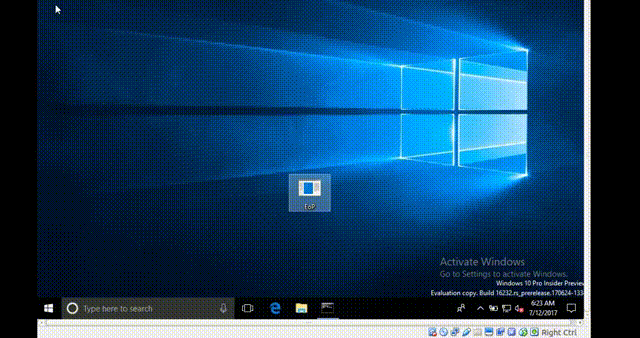
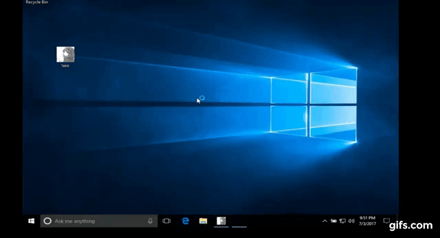
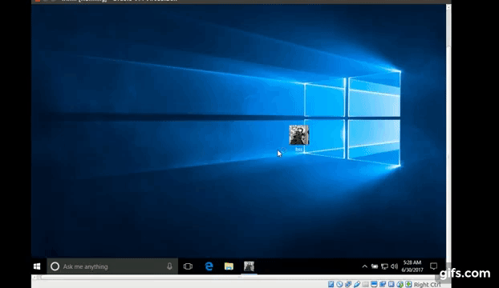
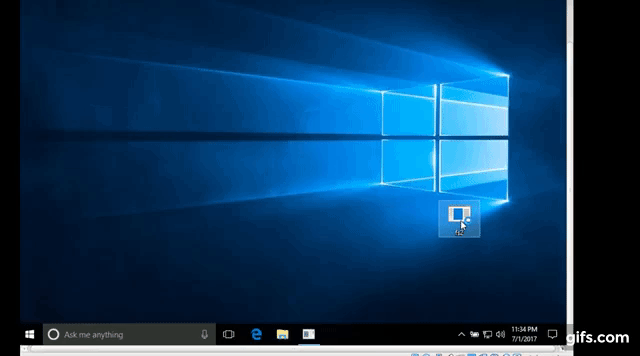
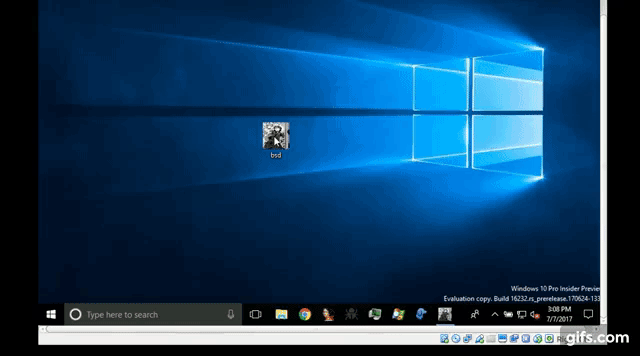
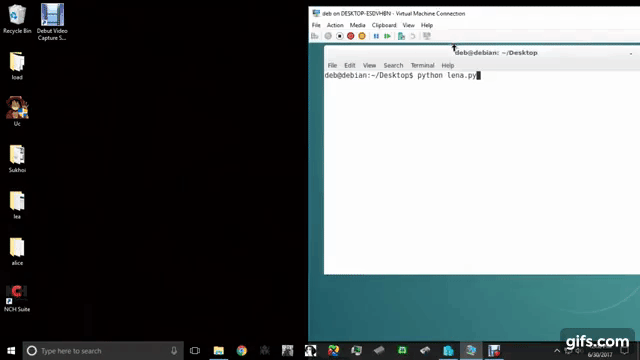
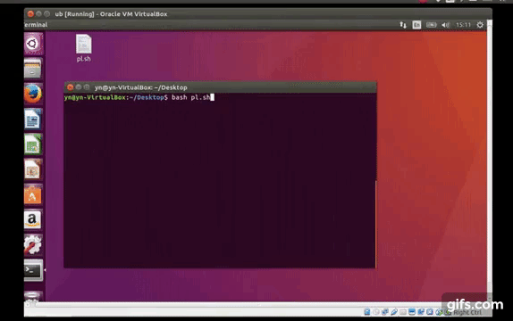

# description
verius exploitation techniques to attack the intel x86 architecture in order to bypass protection mechanisms, cause memory corruption & to take over the instruction pointer, over multiple operating systems and cpu platforms and a reverse analysis of the intel processor architecture exploitation, this includes a windows, linux & an OSx version's.

# Tech
For Source Code & Technical Methods please reffer to The <html><a href="https://github.com/kukuriku/ATK/tree/master/src">Source Code</a></html> Section.

# STATUS

# lena;

author: <html><a href="https://twitter.com/Yena0xC5">@Yena</a></html>. 
cfg ,system failure, privilege acceleration, arbitrary code execution. 
Rtl Check failure.<html><a href="https://github.com/kukuriku/Mitigation/tree/master/lena">ref</a></html> 

# NOT FIXED OS design failure. (win-generic/linux)

<table>
    <tr>
        <th>CVE Request 349130 for CVE ID Request</th>
        <td>Status - No answer.</td>
    </tr>
    <tr>
        <th>MSRC Case 39225 TRK:0461001454</th>
	<td>Closed Read <html><a href="https://github.com/kukuriku/Mitigation/tree/master/lena">MsResponse</a></html></td>
    <tr>
        <th>google exploit db</th>
        <td>Status - No answer.</td>
     <tr/>
    <tr>
        <th>bugzilla.kernel.org</th>
        <td>Status - Not fixed. <a href="https://bugzilla.kernel.org/show_bug.cgi?id=196229">Bug 196229</a></td>
	</tr>
	<tr>
	<th>Intel Product Security Incident Response Team</th>
	<td>an open case, still not fixed.</td>
</table>

# Iaso;

author: sérine. 
cfg, rop, brute forcing the ASLR, SEHOP ,DEP. 
<html><a href="https://github.com/kukuriku/Mitigation/tree/master/Iaso">ref</a></html> 

# NOT FIXED OS design failure. (win-generic/linux)

<table>
    <tr>
        <th>CVE </th>
        <td>Not submitted</td>
    </tr>
    <tr>
        <th>MSRC</th>
        <td>Not submitted</td>
    <tr>
        <th>google exploit db</th>
        <td>Not submitted</td>
     <tr/>
    <tr>
        <th>bugzilla.kernel.org</th>
        <td>Not submitted</td>
	</tr>
	<tr>
	<th>Intel Product Security Incident Response Team</th>
	<td>Not submitted</td>
</table>

# Proof Of Concept
# RS3 16232 EoP
# reverse jump procedure & ROP.

# fuzzing Win On Oracal
# direct memory access & return oriented programming.

# win 10 build 15063.143
# indirect call.

# win 10 build 15063.143
# return oriented programming.

# RS3 16237
# indirect call.

# RS3 16237
# indirect call.

# OS X Mavericks v10.9.5, Darwin 13.4
# indirect call.

# RS3 16237
# reverse jump procedure & ROP.

# Debien On HyperV
# reverse jump procedure & ROP.

# Ubuntu 16.04.2 LTS (Xenial Xerus)
# indirect call.

# Copyrights © Numéro du projet sept sérine.

