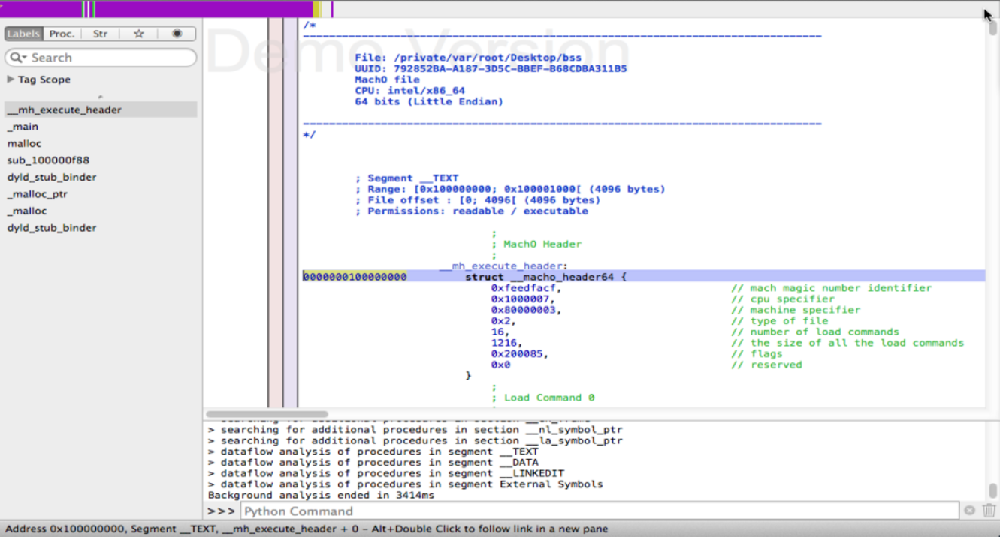
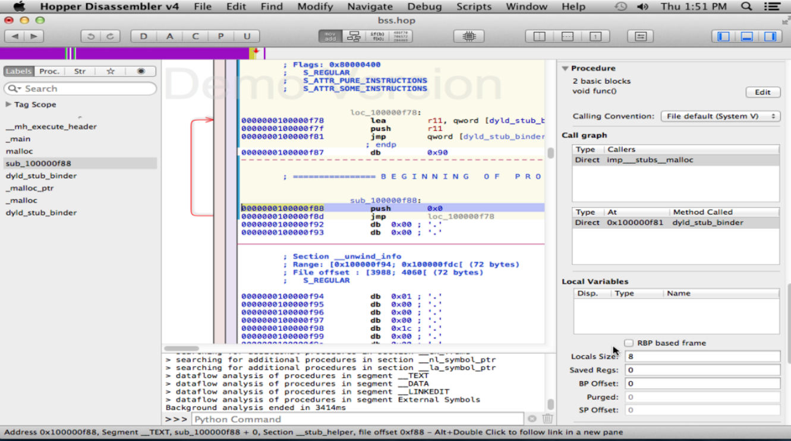
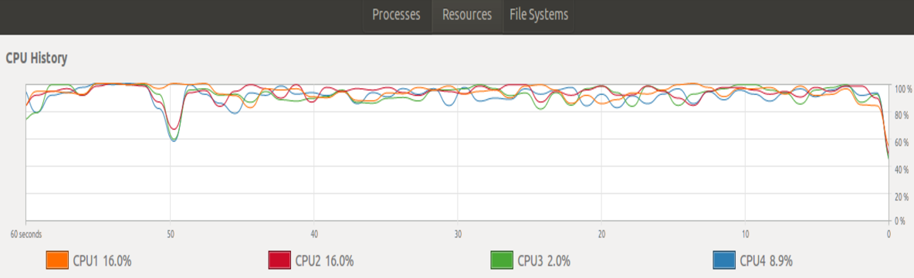

# Description 

# Reverse Analysis Of The linking process at the OSx kernel, while operating a stack based buffer overflow. at this point i hope the reader did go throw ReUnix & ReWin, and as i suppose so, this section is going to be much more Brief.

as far as i have witness there's not much differance on the efect to the operating system by running this exploit between the mac OSx and the other operating systems. how ever the linkin process and the "tubing" to the intel processor take a much more simple process as the reader should see ahed.

#    Tested on:

    Operating System: OS X Mavericks v10.9.5, Darwin 13.4.
    Vmware: Oracle VM VirtualBox, operating with two cores and
    Hyper-v acceleration
    HP Pavilion Desktop - 510-p020
    Intel® Core™ i5-4460S Processor
   
# Executable description
The payload executable section is only 63 lines, while the entire disassembly, 
breaks down to 8 section:
1) _mh_execute_header: that contains the information for the linking library (<html><a href="https://github.com/opensource-apple/dyld/tree/3f928f32597888c5eac6003b9199d972d49857b5">libSystem.B.dylib</a></html>)
2) _main: the main execution scheme, that, pretty much, just loads the main routine as an infinite loop.
3) _malloc: who loads The standard <html><a href="https://github.com/opensource-apple/dyld/blob/3f928f32597888c5eac6003b9199d972d49857b5/src/dyldNew.cpp">malloc</a></html> function from dylib. 
4) _sub_addr: that allocates the first parameters to the stack, and makes a jump to the dyld_stub_binder.
5) _dyld_stub_binder: a wrapper beetwin the operating system interupts and the instruction set <html><a href="https://github.com/kukuriku/ByPassCfg/blob/master/ReOSX/bin/dyld_stub_binder.asm">ref</a></html>.  
6) _malloc_ptr: allocates the pointers to our instruction set.
7) _malloc, like before.
8) _dyld_stub_binder, to again load the instruction set given before.

as the reader can see for himself, the tube to the operating system, and the hardware execution is straightforward.
while reversing the linker operation is not (to my big suprise) a difficult job. as the simplicity of the asseambly 
process is transperent. to operate a hook to any interupt call, or execution state, one can simply override the image,
execution flags, as there is no control flow guard invovled at any stage of the process.
the impect on the hardware abillty to function is immediate, as my entire system (not only the vm) was just 
overpressured.

# Impact;

# additional Resources:
 the reader may reffer to the bin/pic directory, to Reverse by himself on different operating systems, 
 or on different hardware/vmware. 
    
 <html><a href="https://github.com/opensource-apple/dyld/tree/3f928f32597888c5eac6003b9199d972d49857b5">Kernel</a></html> 
<html><a href="https://github.com/kukuriku/ByPassCfg/blob/master/ReOSX/bin/bss.asm">payload</a></html> <html><a href="https://www.virustotal.com/en/file/66ea0dd4879d93a2a8c6f480c91fb9be7808a68e7dd377b9b30e6292b9e3249f/analysis/1498763291/">Vt & Tech</a></html> 

