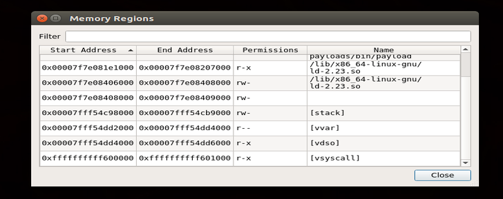
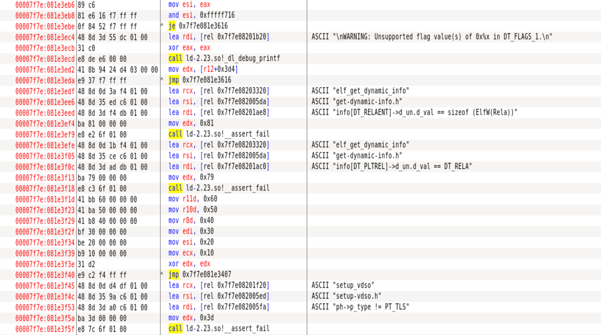
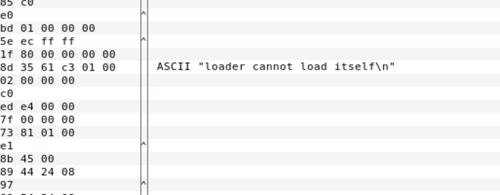
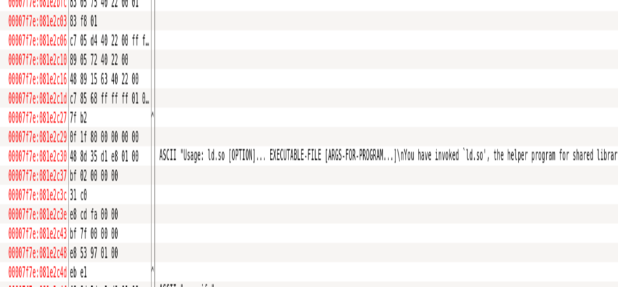
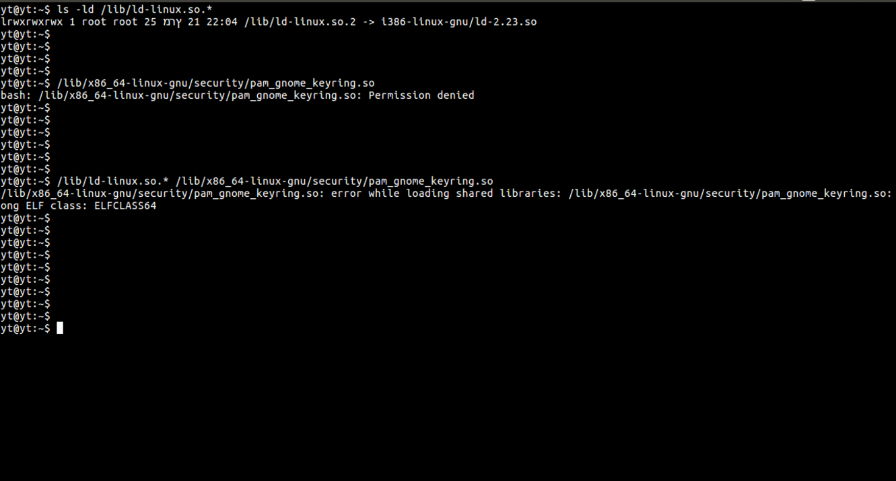
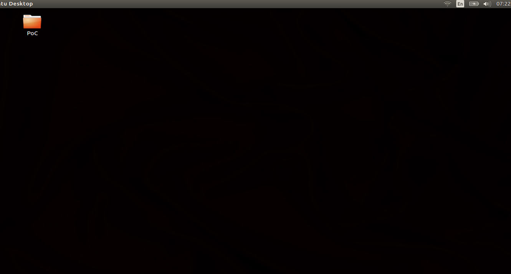
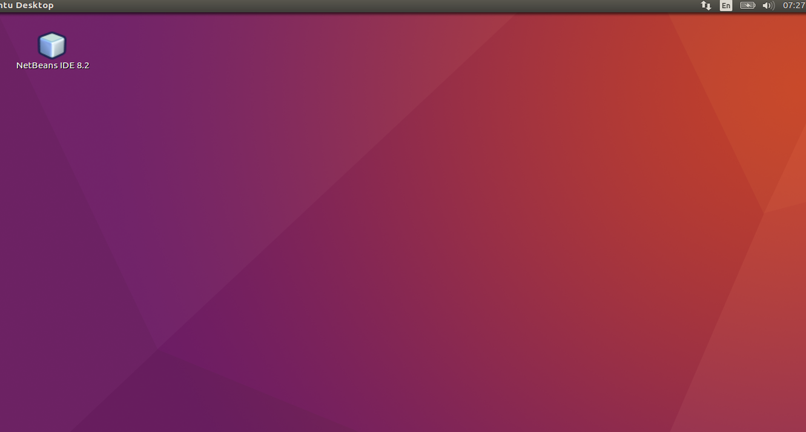

# Stack-based buffer overflow can exploit the ld-2.23.so lib located /lib/x86_64-linux-gnu at the Linux kernel, to allow local users to cause a denial of service (system crash) or possibly gain privileges, due to user flags assertion failure at The vsyscall and vDSO segments. 

#    Tested on: 

    Operating System: Ubuntu 16.04.2 LTS (Xenial Xerus)
    Last modified: 05/11/2017
    HP Pavilion Desktop - 510-p020
    Intel® Core™ i5-4460S Processor

by exploiting The vDSO a user can get:

read and execute from ld-2.23.so (protected system files)  
read and write to ld-2.23.so  
read and write to the stock  
execute as sys.  

vsyscall and vDSO are two mechanisms used to accelerate certain system calls in Linux, which was added as a way to execute specific system calls which do not need any real level of privilege to run in order to reduce the system call overhead.
However, this vsyscall mechanism has some limitations: the memory allocated is small and allows only 4 system calls, and, more important and serious, the vsyscall page is statically allocated to the same address in each process, since the location of the vsyscall page is nailed down in the kernel ABI. This static allocation of the vsyscall compromises the benefit introduced by the memory space randomisation commonly used by Linux. An attacker, after compromising an application by exploiting a stack-overflow, can invoke a system call from the vsyscall page with arbitrary parameters.

The core library's that loads and execute the nessecary shared objects for a native program at the linux kernel are the
ld.so library family.  

it was found that ld-2.23.so utilize the /glibc/elf/get-dynamic-info.h for flag assertion when loading and executing 
native gnu programs at the linux kernel. 

at line 162 at the get-dynamic-info.h header, The main function that initiate the
programm native resources makes an assertion error. in order to provide support for older programm vertions. 
Quote: 
<html><a href="https://code.woboq.org/userspace/glibc/elf/get-dynamic-info.h.html">source</a></html>
  lines: 162 - 176 
   
162   if (info[VERSYMIDX (DT_FLAGS_1)] != NULL) 
163	    { 
164	      l->l_flags_1 = info[VERSYMIDX (DT_FLAGS_1)]->d_un.d_val; 
165	 
166	      /* Only DT_1_SUPPORTED_MASK bits are supported, and we would like 
167	         to assert this, but we can't. Users have been setting 
168	         unsupported DF_1_* flags for a long time and glibc has ignored 
169	         them. Therefore to avoid breaking existing applications the 
170	         best we can do is add a warning during debugging with the 
171	         intent of notifying the user of the problem.  */ 
172	      if (__builtin_expect (GLRO(dl_debug_mask) & DL_DEBUG_FILES, 0) 
173	          && l->l_flags_1 & ~DT_1_SUPPORTED_MASK) 
174	        _dl_debug_printf ("\nWARNING: Unsupported flag value(s) of 0x%x in DT_FLAGS_1.\n", 
175	                          l->l_flags_1 & ~DT_1_SUPPORTED_MASK); 
176	 

The function maps the flags loaded by the application but only alerts the user of a fatal error, while not aborting the procedure call. more severe is the entry at lines: 914-934 at the get-dynamic-info.h:

Quote: 
   
      /* Now the map for the main executable is available.  */ 
915	      main_map = GL(dl_ns)[LM_ID_BASE]._ns_loaded; 
916	 
917	      if (__builtin_expect (mode, normal) == normal 
918	          && GL(dl_rtld_map).l_info[DT_SONAME] != NULL 
919	          && main_map->l_info[DT_SONAME] != NULL 
920	          && strcmp ((const char *) D_PTR (&GL(dl_rtld_map), l_info[DT_STRTAB]) 
921	                     + GL(dl_rtld_map).l_info[DT_SONAME]->d_un.d_val, 
922	                     (const char *) D_PTR (main_map, l_info[DT_STRTAB]) 
923	                     + main_map->l_info[DT_SONAME]->d_un.d_val) == 0) 
924	        _dl_fatal_printf ("loader cannot load itself\n"); 
925	 
926	      phdr = main_map->l_phdr; 
927	      phnum = main_map->l_phnum; 
928	      /* We overwrite here a pointer to a malloc()ed string.  But since 
929	         the malloc() implementation used at this point is the dummy 
930	         implementations which has no real free() function it does not 
931	         makes sense to free the old string first.  */ 
932	      main_map->l_name = (char *) ""; 
933	      *user_entry = main_map->l_entry; 
 

The programm operating under guest session causes immediate system crash, as the disassembly of the ld-2.23.so, a jump to a subroutine: 0x00600ff8 defines a byte array, while the xchg %ax, %ax is implemented as a nop operation (exchanging the value of the same register with itself), but The endless loop overruns the processors to cause immediate system crash. 
in addition the stack buffer overflow causes memory corruption, as the later logon to the machine indicates (a change of the desktop background and the appearance of desktop icons that were never set at the desktop entry) [images attached].

at The end of edb log we have noticed a direct invoke msg from the ld-2.23.so: 

# after dumping the ld-2.23.so, we figured to try and invoke the lib dirctlly:

# memory corruption after running the payload

  
# NOTES
    for the windows version please refer to 
<html><a href="https://github.com/kukuriku/ByPassCfg/tree/master/ReWin">windows</a></html>

