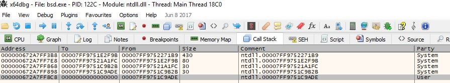
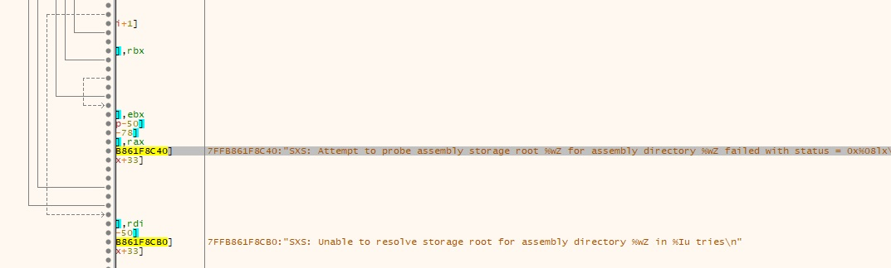
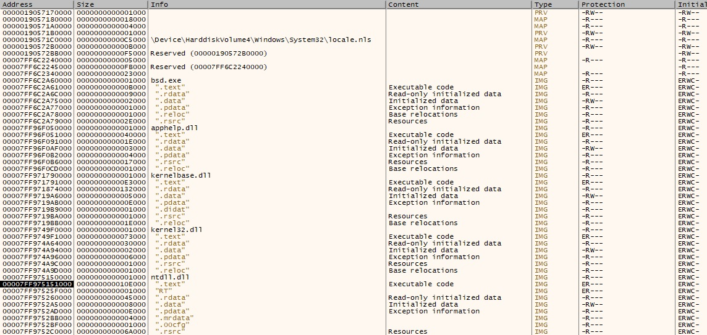
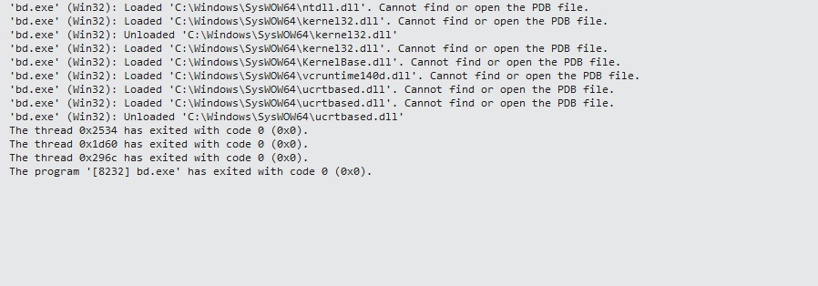
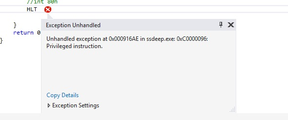
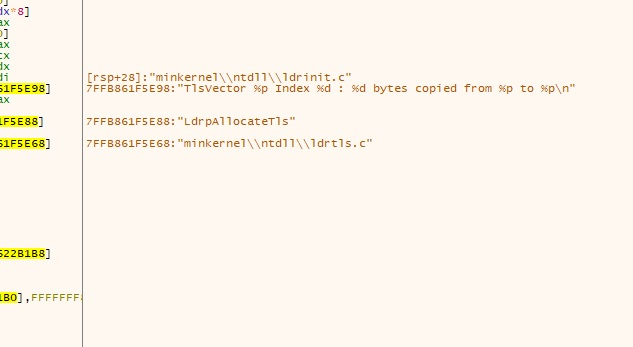
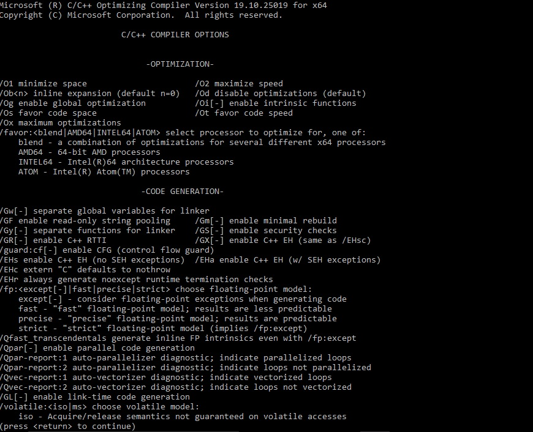
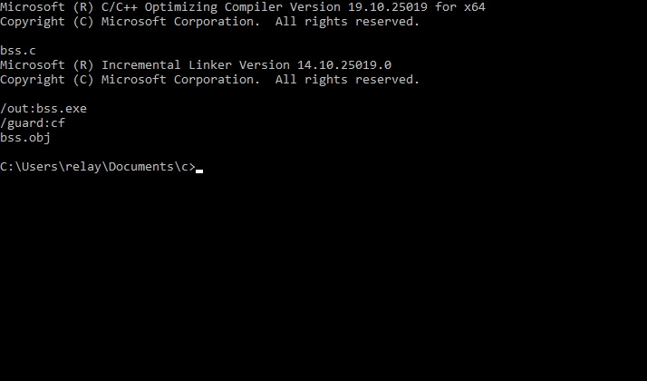

# Description 

# Reverse Analysis Of a stack based buffer overflow at The winx64 kernel

# Main Synopsis
# Rtl Check Failure
To Quote Ms Technical Team:
"It is still not clear to me what the finder is trying to achieve in the POC (bsd.exe/bss.exe). He tries to allocate        0x400 bytes continuously and when it fails manufacture a pointer and calls it indirectly. The manufactured pointer is based on the security cookie (__ROR8__(qword_1400164C0 ^ _security_cookie, _security_cookie & 0x3F)). This is done in the loop.", a little explanation the windows operating system Rtl checks chunks of memory before it executes them for a security cookie, this was implemented as far from win 7*. That is a simple routine maid to avoid execution of corrupted memory instructions s.t a Buffer OverFlow, The "Critical Process dead" bsod, indicates system resources being corrupted, which means that the kernel itself is not checking for the security hash, or even worse, that by indirect call maid by simply implementing a longjmp to to the last successful call one can simply redirect the kernel to execute a null pointer. 
The latest windows build produced a "IRQL not less or equal" which simply means that a low integrity procidure can access critical hardware segments. with no virtualization or paging to avoid the harware corruption.

its redundent to say that instead of a null pointer one can redirect to an entire instruction set, leading to further exploitation opportunities.

# introduction:
The <html><a href="https://msdn.microsoft.com/en-us/library/aa939644(v=winembedded.5).aspx">MinKernel</a></html>
Macro component is a macro component that bundles the components that are required to create a kernel run-    time    image. By using this component you can quickly generate a kernel run-time image using the Session Manager component, with a                minimal expected footprint. by invoking The minkernel component at The windows operating system core, one can create a corrupted          instruction set, bypassing The <html><a href="https://msdn.microsoft.com/en-us/library/windows/desktop/mt637065(v=vs.85).aspx">Control Flow Guard</a></html> (s.t->CFG) leading to memory corruption and immediate system crush.
In-Addition, The Windows Kernel fails to Recognize The Currupted Memory Regions OverRun,
That is a major suprise Taking in mind The <html><a href="https://msdn.microsoft.com/en-us/library/aa290051(v=vs.71).aspx">Security Cookie Rtl Check</a></html>.

   it is possible for one to exploit winx64 kernel to invoke memory corruption,  
   and to bypass The Control Flow Guard.  
   to exploit this vulnerability, as little as UnTrusted integritylevel. 
   and to execute a simple 70kb executable. 
   by doing so, The user is granted access to CFG protected memory regions within 
   The win kernel, causing immediate system crash and possibly 
   gain execution privileges to protected NT system calls, 
   and to overrun System Protected Memory Regions To Cause HardWare Corruption. 
   This is Done by consistant indirect call To a pointer to a memory Region Allocated by The Main Thread 
   and can be further implemented by ROP (s.t-return oriented programming, e.i: return address Corruption.). 

The reader may refer to The '/bin/beginimport' for the specific symbols loaded
   
#    Tested on:

    Operating System: windows 10 pro edition, win 8.1 pro, Ubuntu 16.04.2 LTS (Xenial Xerus)
    Last modified: 15/06/2017
    HP Pavilion Desktop - 510-p020
    Intel® Core™ i5-4460S Processor
   
# Technical details
    lets start with the rc data and the wrapper that makes this exploit possible,
    as The user can see a call is maid to "minkernel\\ntdll\\ldrinit.c" to create
    The com object that the application use.

    as stated before The ldrinit.c located at the minkernel is responsible for loading the application symbols, 
    and to link to the dll exported functions that the application uses later.
    lets see whats going on at the init module:

    the ldrinit.c loads apphelp.dll, kernelbase.dll, kernel32.dll & ntdll.dll
    all with read & execute permissions.

    compare with The visual studio linker and youll get an error: access violation:

    a very simple chack verified The permission rights, when instructing The prog to make
    xfd s.t: HLT command (privilege command) ended up with an access violation on the
    visual studio linker, while in run time we did not found any problam to execute. 
    more interesting is this line at The .log dump: 
 
    The reader may reffer to line 1244 at The ldrinit.c attached to this repo, while this line at
    the debugger: 

    indicates back to a usage of The RtlStringCbCopyEx 
<html><a href="https://msdn.microsoft.com/en-us/library/windows/hardware/ff562807(v=vs.85).aspx">ref...</a></html>
    as this error is thrown by the use of this function
    <html><a href="https://www.google.com/search?q=caller+passed+nonzero+buffer+length+but+NULL+buffer+pointer&rlz=1C1CHZL_iwIL748IL748&oq=caller+passed+nonzero+buffer+length+but+NULL+buffer+pointer&aqs=chrome..69i57.727j0j7&sourceid=chrome&ie=UTF-8#q=caller+passed+non+zero+buffer+length+but+NULL+buffer+pointer">#</a></html>, more interesting is that to use this function you have to include 
    Ntstrsafe.lib 
    meaning that there is a CFG unabled, and this even make a lot of sense, due to many 'RtValidate' functions calls 
    The reader may reffer to the ldrinit.c attached and to the log dump attached and see that a verification process is indeed 
    called in every step of the image loading and the dynamic linking. 
    The problem as i see it is at The: 
    is at lines: 1437 - 1433 at ldrinit.c where the 'LdrpValidateImageForMp' function is just not implemented, 
    this is the cause that the thread is initialized with the wrong parameters, while handling this bug is assaign to the Thread pool to terminate the Thread, but at that point of time its too late, cuz the programm allready writs to extended memory regions corrupting additional instruction to the operating system to cause immediate systewm crash. The reader may reffer to the log dump attached to this repo. 
    Now to the Memory corruption mechanism: 
    according to <html><a href="https://www.intel.com/Assets/en_US/PDF/manual/253668.pdf">intel</a></html> page 68, 
    To increase the memory of an application pool the intel architecture utilizes 'paging' allowing app data to be virtualized into deep memory fragments, so when the programm Thread starts, and initilize The ldrinit.c making calls to Virtual Allocate, and The cfg machanisem do not stop the propogation of the programm then memory is writen to disk corrupting the instruction set held to other critical sys components to couse an imidiate denaiel of service and total system crash.
    

# NOTES
    for the linux version please refer to 
<html><a href="https://github.com/kukuriku/UniversalDanielOfService/tree/master/ReUnix">linux</a></html>
    
# addendum
   at The end of the day the MS CFG did take action & tried to terminate The payload, but becouse the linking 
   is maid dynamiclly at a 'java-like' style, Most of The fundamental instruction to the kernel, 
   were build before Run time, and included error and defected instruction set. leading to a system failure. 
   one can utilize this Technique to execute any arbitrary assembly. 
    
   i strongly advise you to look carefully at the documents attached. 
   
# [Poc] -> Run bsd.exe (compiled without cfg), or alternatively run bss.exe (compiled with cfg),

# external links:
<html><a href="http://windows10dll.nirsoft.net/apphelp_dll.html">apphelp.dll</a></html> 
<html><a href="http://www.52pojie.cn/thread-161284-1-1.html">ntdll debug sys call</a></html> 
<html><a href="https://undocumented.ntinternals.net/index.html?page=UserMode%2FUndocumented%20Functions%2FError%2FNtRaiseHardError.html">undocumented nt_api</a></html> 
<html><a href="https://msdn.microsoft.com/en-us/library/610ecb4h.aspx">compiler</a></html>

